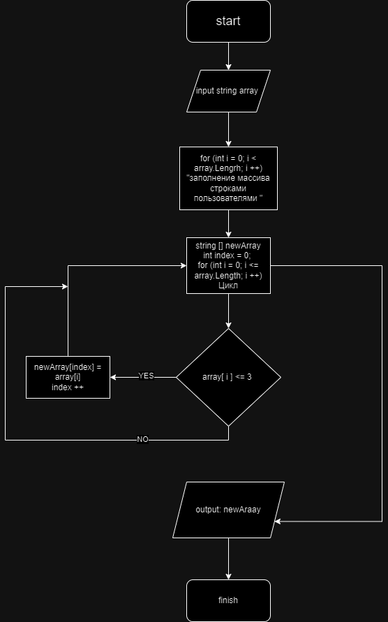

### Описание решения
## Задача 
Написать программу, которая из имеющегося массива строк формирует новый массив из строк, длина которых меньше, либо равна 3 символам. Первоначальный массив можно ввести с клавиатуры, либо задать на старте выполнения алгоритма. При решении не рекомендуется пользоваться коллекциями, лучше обойтись исключительно массивами.
## Алгоритм

Для решения задачи использовался еще один дополнительный массив и два цикла, один для заполнения массива пользователем, другой для отсеивания 

